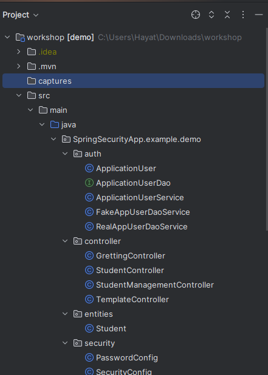

# Student Management System

This is a small student management system built using Spring Boot and Spring Security to secure the application.

## Description

The Student Management System is designed to help educational institutions manage student data efficiently. It provides functionalities such as:

- Registration of students
- Viewing student details
- Updating student information
- Deleting student records

